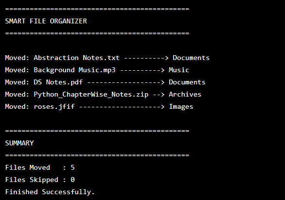

# Smart File Organizer

A simple Python application that automatically organizes files into folders based on file type.

## Features

- Organizes files automatically
- Creates folders if they don't exist
- Supports Images, Documents, Videos, Music, Archives, Programs, and Others
- Prevents duplicate file overwrites
- Easy to customize

## Technologies

- Python
- os
- shutil

## How to Run

1. Change the folder path inside `organizer.py`
2. Place files inside the target folder
3. Run:

```bash
python organizer.py
```

## Preview


The files will automatically be organized.
